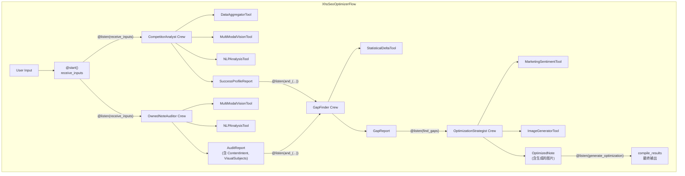

# 内容理解和建议agent子系统

## 系统架构 (CrewAI Flow)



## 核心概念

这是一个数据驱动的内容优化系统。核心思想是**"对比分析" (Gap Analysis)**：精确找到"优等生"(`target_notes`)和"偏科生"(`owned_note`)之间的关键差异，然后针对性地优化。

**核心问题:**
- Q1: 为什么 `target_notes` 打分高？
- Q2: 为什么 `owned_note` 打分低？
- Q3: 应该怎么改？

---

## 1. Crew 与 Agent 设计

### 1.1 CompetitorAnalyst Crew (竞品分析师)

**Role:** 分析"为什么优等生能考高分"

**输入:**
- `target_notes[]`: 竞品笔记列表
- `keyword`: 目标关键词

**工具:**
- `DataAggregatorTool`: 聚合统计数据
- `MultiModalVisionTool`: 视觉分析
- `NLPAnalysisTool`: 文本分析

**输出:** `SuccessProfileReport`
- 10个指标的成功模式分析
- 关键成功因素
- 爆款公式总结

### 1.2 OwnedNoteAuditor Crew (自营笔记审计员)

**Role:** 客观诊断 `owned_note` 的现状

**输入:**
- `owned_note`: 待优化笔记
- `keyword`: 目标关键词

**工具:**
- `MultiModalVisionTool`: 视觉特征提取
- `NLPAnalysisTool`: 文本特征提取

**输出:** `AuditReport`
- 文本特征 (30+ 个)
- 视觉特征 (17+ 个)
- 当前指标数值
- **ContentIntent**: 内容意图 (core_theme, target_persona, key_message)
- **VisualSubjects**: 视觉主体 (subject_type, must_preserve, brand_elements)
- 营销感检测 (marketing_level, is_soft_ad)

### 1.3 GapFinder Crew (差距定位员)

**Role:** 对比分析，识别关键差距

**输入:**
- `SuccessProfileReport`
- `AuditReport`
- `keyword`

**工具:**
- `StatisticalDeltaTool`: 计算显著性差异 (z-score, p-value)

**输出:** `GapReport`
- 显著差距 (p < 0.05)
- 边际差距 (0.05 ≤ p < 0.10)
- 非显著差距
- 优先级排序
- 根因分析
- 特征归因 (missing_features, weak_features)

### 1.4 OptimizationStrategist Crew (优化策略师)

**Role:** 生成具体可执行的优化方案

**输入:**
- `GapReport`
- `AuditReport`
- `SuccessProfileReport`
- `owned_note`
- `keyword`

**Agents:**
- `optimization_strategist`: 生成文本优化建议
- `image_generator`: 调用 AIGC 生成图片

**工具:**
- `MarketingSentimentTool`: 营销感检测
- `ImageGeneratorTool`: 图片生成 (OpenRouter Gemini)

**输出:** `OptimizedNote`
- 优化后的标题、内容
- 生成的封面图和内页图
- 优化摘要
- 营销合规检查 (如为软广)

---

## 2. 工作流 (Flow)

使用 **CrewAI Flow** 实现并行执行和状态管理：

### 2.1 执行流程

```
@start()
    receive_inputs
         |
         +---------------------------+
         |                           |
@listen(receive_inputs)    @listen(receive_inputs)
         |                           |
         v                           v
 analyze_competitors         audit_owned_note
 (CompetitorAnalyst)        (OwnedNoteAuditor)
         |                           |
         +---------------------------+
                     |
         @listen(and_(a, b))
                     |
                     v
                find_gaps
              (GapFinder)
                     |
         @listen(find_gaps)
                     |
                     v
          generate_optimization
         (OptimizationStrategist)
                     |
         @listen(generate_optimization)
                     |
                     v
            compile_results
                     |
                     v
               Final Output
```

### 2.2 状态管理 (XhsSeoFlowState)

```python
class XhsSeoFlowState(BaseModel):
    # 用户输入
    keyword: str
    target_notes: List[Dict]
    owned_note: Dict

    # 中间输出
    success_profile_report: Optional[SuccessProfileReport]
    audit_report: Optional[AuditReport]
    gap_report: Optional[GapReport]

    # 最终输出
    optimized_note: Optional[OptimizedNote]

    # 元数据
    flow_started_at: Optional[str]
    flow_completed_at: Optional[str]
    errors: List[str]
```

### 2.3 并行执行

- **CompetitorAnalyst** 和 **OwnedNoteAuditor** 并行运行
- 使用 `@listen(and_(analyze_competitors, audit_owned_note))` 等待两者完成
- **GapFinder** 在两个 Crew 都完成后才执行

---

## 3. 工具 (Tools)

| 工具 | 功能 | 使用者 |
|------|------|--------|
| `DataAggregatorTool` | 聚合 target_notes 的统计数据 | CompetitorAnalyst |
| `MultiModalVisionTool` | 视觉分析 (OCR, 风格, 构图) | CompetitorAnalyst, OwnedNoteAuditor |
| `NLPAnalysisTool` | 文本分析 (30+ 特征) | CompetitorAnalyst, OwnedNoteAuditor |
| `StatisticalDeltaTool` | 计算显著性差异 | GapFinder |
| `MarketingSentimentTool` | 营销感检测 | OptimizationStrategist |
| `ImageGeneratorTool` | AIGC 图片生成 | OptimizationStrategist |

---

## 4. 数据模型

### 4.1 输入模型

```python
# Note 模型
{
    "note_id": str,
    "title": str,
    "content": str,
    "meta_data": {
        "cover_image_url": str,
        "inner_image_urls": List[str],
        ...
    },
    "prediction": {
        "ctr": float,
        "comment_rate": float,
        ...
    },
    "tag": {
        "taxonomy2": str,
        "intention_lv2": str,
        ...
    }
}
```

### 4.2 输出模型

```python
# OptimizedNote 模型
{
    "note_id": str,              # original_id + '_optimized'
    "original_note_id": str,
    "keyword": str,
    "title": str,                # 优化后标题
    "content": str,              # 优化后内容
    "cover_image_url": str,      # 生成或保留原始
    "inner_image_urls": List[str],
    "content_intent": ContentIntent,
    "marketing_check": MarketingCheck,  # 如为软广
    "optimization_summary": str,
    "cover_image_source": str,   # "generated" | "original"
    "inner_images_source": str,  # "generated" | "original" | "mixed"
}
```

---

## 5. 使用方式

### 5.1 Flow 模式 (推荐)

```python
from xhs_seo_optimizer.flow import XhsSeoOptimizerFlow
from xhs_seo_optimizer.flow_state import XhsSeoFlowState

flow = XhsSeoOptimizerFlow()
flow.state = XhsSeoFlowState(
    keyword="老爸测评dha推荐哪几款",
    target_notes=target_notes,
    owned_note=owned_note,
)

result = flow.kickoff()
optimized_note = result.optimized_note
```

### 5.2 独立 Crew 模式 (向后兼容)

```python
# 各 Crew 可独立运行，通过文件传递数据
from xhs_seo_optimizer.crew_competitor_analyst import XhsSeoOptimizerCrewCompetitorAnalyst

crew = XhsSeoOptimizerCrewCompetitorAnalyst()
result = crew.crew().kickoff(inputs={
    "target_notes": target_notes,
    "keyword": keyword,
})
```

---

## 6. 关键设计原则

1. **数据驱动**: 所有决策基于统计数据和特征分析
2. **并行执行**: 最大化利用并行能力减少总时间
3. **内容一致性**: ContentIntent 确保优化后内容意图不变
4. **视觉一致性**: VisualSubjects 确保生成图片保留核心元素
5. **营销合规**: 软广笔记自动检测并调整策略
6. **向后兼容**: 支持 Flow 模式和独立 Crew 模式
