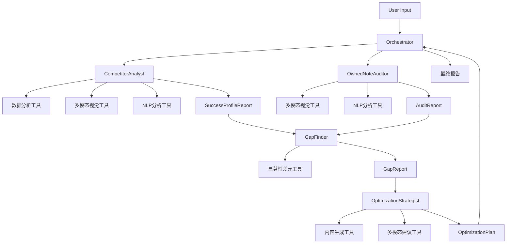

# 内容理解和建议agent子系统

这是一个非常棒的AI+SaaS场景！你手上的数据（`meta_data`, `prediction`, `tag`）是金矿，它们完美地将“表象”和“归因”连接了起来。

你不是在问“我的笔记为什么火不了？”

你是在问“我的笔记的comment_rate为什么比竞品低15%，并且模型给我的note_marketing_integrated_level标签是‘高’，而竞品是‘中’？我该如何修改我的meta_data（文案、封面）来提升comment_rate并降低‘营销感’？”

这是一个定义清晰、数据完备的问题。设计Agent系统来自动化这个分析和优化流程，是绝佳的思路。

---

### Agents系统设计蓝图

这个系统的核心思想是**“对比分析” (Gap Analysis)**。我们不需要从零开始创作，而是要精确地找到“优等生”(`target_notes`)和“偏科生”(`owned_note`)之间的关键差异，然后针对性地补课。

我为你设计一个由5个Agent组成的协作团队：

1. **Orchestrator (项目总监)**
2. **CompetitorAnalyst (竞品分析师)**
3. **OwnedNoteAuditor (- 客户笔记诊断师)**
4. **GapFinder (- 差异定位器)**
5. **OptimizationStrategist (优化策略师)**

---

### 1. Agent 角色与任务 (Role and Task)

### 1.1. Orchestrator (项目总监)

- **Role:** 整个工作流的总指挥和调度中枢。它接收用户原始输入，拆解任务，分发给下游Agents，并汇总最终的报告。
- **Task:**
    - 接收 `keyword`, `target_notes[]`, `owned_note`。
    - **并行触发** `CompetitorAnalyst` 和 `OwnedNoteAuditor`。
    - 收集前两者的分析报告，**触发** `GapFinder` 进行对比。
    - 收集`GapFinder`的差异报告，**触发** `OptimizationStrategist` 提出建议。
    - 汇总所有Agents的产出，整合成一份完整的、可读的分析报告（回答你的三个核心问题）。

### 1.2. CompetitorAnalyst (竞品分析师)

- **Role:** 专门分析“为什么优等生能考高分”。它只看 `target_notes`。
- **Task:**
    - **输入:** `target_notes[]`, `keyword`
    - **分析 (Q1: 为什么target_notes打分高):**
        - **数据聚合 (Tool):** 计算 `target_notes` 在 `prediction` 和 `tag` 上的平均值和众数（例如：平均 `sortScore` 是多少？90%的笔记 `taxonomy2` 都是“xx”）。
        - **模式识别 (LLM):** 找出 `meta_data` 和高分 `prediction`/`tag` 之间的强关联。
            - *"我发现，所有高 `CTR` 的笔记，它们的 `cover_image` 都使用了高饱和度滤镜和“痛点疑问句”文案 (Tool: MultiModal)。"*
            - *"我发现，所有高 `comment_rate` 的笔记，它们的 `content` 结尾都包含了一个开放式问题 (Tool: NLP)。"*
            - *"我发现，所有 `sortScore` 高的笔记，它们的 `intention_lv2` 标签都是‘干货分享’，而不是‘产品种草’。"*
    - **输出:** `SuccessProfileReport` (成功画像报告)，总结出该关键词下的“爆款公式”。

### 1.3. OwnedNoteAuditor (客户笔记诊断师)

- **Role:** 专门诊断“偏科生”的现状。它只看 `owned_note`。
- **Task:**
    - **输入:** `owned_note`
    - **分析:**
        - **现状描述:** 简述笔记的各项得分和标签。
            - *"笔记的 `CTR` 处于中位，但 `comment_rate` 极低。"*
            - *"笔记的 `note_marketing_integrated_level` 标签为‘高’，`taxonomy3` 偏离了主题。"*
        - **内容审查 (Tool):** 分析 `meta_data` 的具体特征。
            - *"`title` 是一个陈述句，缺乏吸引力。"*
            - *"`cover_image` (Tool: MultiModal) 风格更像广告硬照，缺乏生活感。"*
            - *"`content` (Tool: NLP) 通篇在介绍产品功能，没有引导互动的钩子。"*
    - **输出:** `AuditReport` (诊断报告)，说明笔记的当前表现和内容特征。

### 1.4. GapFinder (差异定位器)

- **Role:** 关键的对比环节。它不产生新内容，只做“找茬”。
- **Task:**
    - **输入:** `SuccessProfileReport` (from 1.2), `AuditReport` (from 1.3)
    - **分析 (Q2: 为什么owned_note打分低):**
        - 逐项对比两个报告，找出 `owned_note` 在 `prediction` 和 `tag` 上的**显著差距 (Delta)**。
        - 将这些“分数差距”归因到 `meta_data` 和 `tag` 的“特征差距”上。
            - *"**差距1 (分数):** `owned_note` 的 `comment_rate` 比 `target_notes` 均值低 80%。"*
            - *"**归因 (特征):** `target_notes` 均有互动钩子，`owned_note` 没有。`target_notes` 的 `intention_lv2` 标签是‘经验分享’，`owned_note` 是‘产品安利’。"*
            - *"**差距2 (分数):** `owned_note` 的 `CTR` 低 30%。"*
            - *"**归因 (特征):** `target_notes` 的封面 (Tool: MultiModal) 都是“真人实拍+痛点标题”，`owned_note` 的封面是“产品精修图”。"*
    - **输出:** `GapReport` (差异分析报告)，清晰列出所有差距及其可能的原因。

### 1.5. OptimizationStrategist (优化策略师)

- **Role:** 团队的“创意大脑”和“执行者”，负责解决问题。
- **Task:**
    - **输入:** `GapReport`, `owned_note`
    - **分析 (Q3: 应该怎么改):**
        - 针对 `GapReport` 中的每一个“差距”，提出**具体的、可执行的** `meta_data` 修改建议。
        - **这必须是“生成性”的，而不仅仅是“建议性”的。**
            - **针对 `GapReport-差距1(comment_rate)`:**
                - **建议:** 在文末增加互动钩子。
                - **生成:** *“原内容：... 很高兴能发现这个宝藏。 -> **修改建议：** ... 你在[相关领域]有什么独门秘籍吗？在评论区聊聊！我会选一个送出小礼物哦！”*
            - **针对 `GapReport-差距2(CTR)`:**
                - **建议:** 封面图需要更“原生”，标题需要更“有悬念”。
                - **生成:** *“原标题：... [产品名] 测评 -> **修改建议 (3选1):** 1. 救命！为什么我没有早点发现这个... 2. [某痛点] 困扰我3年，终于被它搞定了！ 3. 别再盲目跟风了！[产品] 的真相是...”*
                - **生成:** *“封面 (Tool: MultiModal) **修改建议：** 放弃你的产品精修图。换成一张你本人（或手部）正在使用该产品的抓拍照片，用App自带字体加上新标题。”*
    - **输出:** `OptimizationPlan` (优化方案)，包含具体的文案、封面、内容修改建议。

---

### 2. 工作流 (Workflow)

工作流是**顺序触发和并行-汇合 (Sequential & Parallel-Join)** 的结合体：

1. **Start:** `User` 提交 `keyword`, `target_notes[]`, `owned_note` 给 `Orchestrator`。
2. **Step 1 (Parallel):**
    - `Orchestrator` -> `CompetitorAnalyst` (分析 `target_notes`)
    - `Orchestrator` -> `OwnedNoteAuditor` (分析 `owned_note`)
3. **Step 2 (Join & Trigger):**
    - `Orchestrator` 等待 `SuccessProfileReport` 和 `AuditReport`。
    - `Orchestrator` -> `GapFinder` (输入: `Report 1` + `Report 2`)
4. **Step 3 (Trigger):**
    - `Orchestrator` 等待 `GapReport`。
    - `Orchestrator` -> `OptimizationStrategist` (输入: `GapReport` + `owned_note`)
5. **Step 4 (Finalize):**
    - `Orchestrator` 等待 `OptimizationPlan`。
    - `Orchestrator` 汇总所有报告 (`SuccessProfileReport`, `GapReport`, `OptimizationPlan`)，生成最终回复。

> 可视化流程:
> 
> 
> `[User Input] -> [Orchestrator]
>     |
>     +---> [CompetitorAnalyst] -----> [SuccessProfileReport] --+
>     |                                                        |
>     +---> [OwnedNoteAuditor] ------> [AuditReport] ----------+
>                                                              |
>                                                              v
>                                                [Orchestrator] -> [GapFinder] -> [GapReport]
>                                                                                 |
>                                                                                 v
>                                                [Orchestrator] -> [OptimizationStrategist] -> [OptimizationPlan]
>                                                                                             |
>                                                                                             v
>                                                [Orchestrator] -> [Final Answer to User]`
> 

---

### 3. 所需工具 (Tools)

你的Agents需要一些“武器”来处理这些数据：

1. **MultiModal-Vision-Tool (多模态视觉工具):**
    - **必需！** 你的`meta_data`里有 `cover_image`, `inner_images`, `video_url`。Agent不能只读URL，它必须能“看”。
    - **功能:** 传入图片/视频URL，返回视觉元素的描述、风格、文本内容（OCR）、氛围、是否像广告。
    - **应用:** `CompetitorAnalyst` 和 `OwnedNoteAuditor` 用它来分析视觉元素。`OptimizationStrategist` 用它来理解当前封面并提出修改建议。
2. **DataAggregator-Tool (数据聚合工具):**
    - **功能:** 一个简单的Python脚本。输入 `target_notes[]`，计算 `prediction` 各项指标的均值、中位数、方差；计算 `tag` 各项标签的频次和众数。
    - **应用:** `CompetitorAnalyst` 用它来快速量化“优等生”的共同点。
3. **NLP-Analysis-Tool (自然语言处理工具):**
    - **功能:** 分析 `title` 和 `content`。
    - **子功能:** 情感分析、关键词提取、句式判断（是陈述句、疑问句还是感叹句？）、CTA（Call to Action）钩子检测。
    - **应用:** 所有Agent都会用到，尤其是在分析 `comment_rate` 和 `CTR` 与文案的关系时。
4. **StatisticalDelta-Tool (显著性差异工具):**
    - **功能:** (可选，但很高级) 在 `GapFinder` 中，用来判断 `owned_note` 的分数（如 `CTR=0.5`）和 `target_notes` 的均值（如 `CTR=0.6`）之间的差异是否在统计上显著。
    - **应用:** 帮助 `GapFinder` 优先关注那些“真的拉垮”的指标，而不是那些“看起来低一点但其实在正常波动范围内”的指标。

这个系统设计将你提供的数据利用到了极致，能给出一个数据驱动、逻辑清晰、且可执行性极强的优化方案。

---

接下来，你需要我帮你细化其中某一个Agent的Prompt吗？例如，`OptimizationStrategist` 的提示词会非常关键。