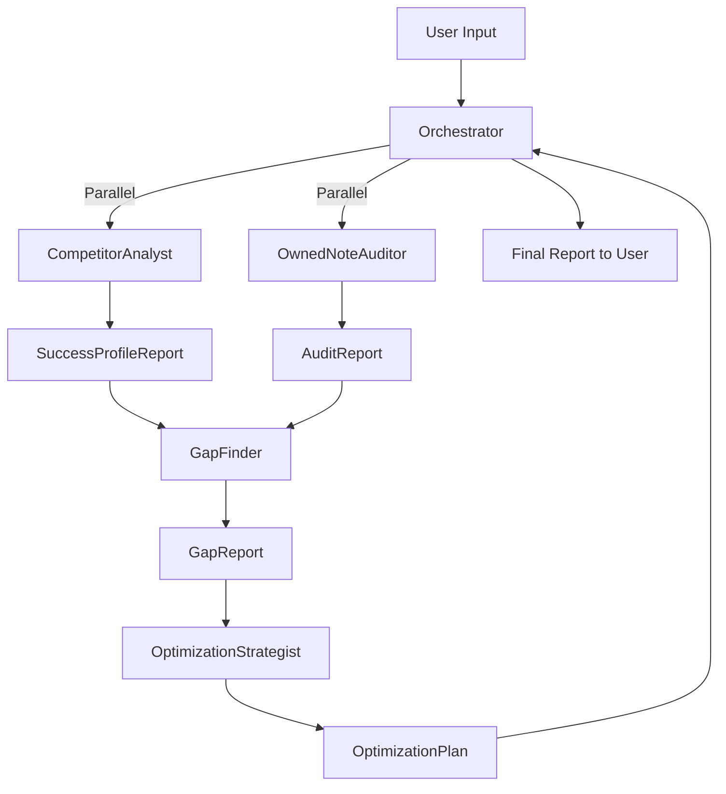

# Project Context

This document provides context for AI assistants working on this project.

## Project Overview

**Project Name:** xhs_seo_note_agent_crewai
**Description:** 小红书SEO笔记内容优化Agent (Xiaohongshu SEO Note Content Optimization Agent)
**Framework:** CrewAI

### Purpose
This project is an AI-powered content optimization system for Xiaohongshu (小红书) notes using multi-agent collaboration. It analyzes why competitor notes rank high and provides actionable, data-driven recommendations to improve client-owned notes' performance metrics (CTR, sortScore, comment_rate, etc.).

**Core Problem Solved:**
- Clients want to know: "Why isn't my note performing well?"
- The system answers THREE critical questions:
  1. Why do top-performing target_notes score high?
  2. Why does my owned_note score low (e.g., comment_rate 15% lower than competitors)?
  3. How should I modify my note's content (title, cover, text) to improve specific metrics?

### Key Features
- **Gap Analysis**: Compare owned notes with high-performing competitor notes across predictions and tags
- **Multi-Modal Analysis**: Analyze text, images, and video content using vision and NLP tools
- **Data-Driven Insights**: Identify statistical correlations between meta_data and performance metrics
- **Actionable Recommendations**: Generate specific, executable suggestions for title, cover image, and content modifications
- **Causality Mapping**: Connect appearance (meta_data) with substance (prediction/tag scores)

## Tech Stack

### Language & Runtime
- **Python Version:** 3.10+
- **Package Manager:** conda + pip
- **Virtual Environment:** `xhs_seo_note_agent_crewai` (conda)

### Frameworks & Libraries
- **CrewAI:** Multi-agent orchestration framework for collaborative AI agents
- **LangChain:** LLM integration and tool calling
- **OpenAI/Anthropic API:** LLM for agent reasoning and content generation
- **Vision API:** For multimodal image/video analysis (OpenAI GPT-4V or similar)
- **NLP Libraries:** spaCy, NLTK, or transformers for text analysis
- **Data Processing:** pandas, numpy for data aggregation and statistical analysis
- **HTTP Client:** requests or httpx for fetching image/video content

### External Services
- **LLM API**: OpenAI GPT-4/Claude for agent reasoning and content generation
- **Vision API**: For multimodal analysis of cover images and inner images
- **Xiaohongshu Data Source**: Pre-processed note data (meta_data, prediction, tag)

### Development Tools
- **Version Control:** Git
- **Testing:** pytest (to be added)
- **Linting/Formatting:** black, ruff (recommended)
- **Environment Management:** conda

## Project Structure

```
xhs_seo_note_agent_crewai/
├── docs/                      # Example data and documentation
│   ├── keyword.json           # Search keyword example
│   ├── owned_note.json        # Client note example
│   ├── target_notes.json      # High-performing competitor notes
│   └── 内容理解和建议agent子系统.md  # Agent system design doc
├── openspec/                  # OpenSpec workflow management
│   ├── AGENTS.md              # Agent workflow instructions
│   ├── project.md             # This file - project context
│   ├── changes/               # Active change proposals
│   └── archive/               # Completed/rejected proposals
├── src/
│   └── xhs_seo_optimizer/     # Main package (CrewAI convention)
│       ├── config/            # YAML configurations
│       │   ├── agents.yaml    # Agent definitions (role, goal, backstory)
│       │   └── tasks.yaml     # Task definitions (description, expected_output)
│       ├── tools/             # Custom tools
│       │   ├── __init__.py
│       │   ├── multimodal_vision.py
│       │   ├── data_aggregator.py
│       │   ├── nlp_analysis.py
│       │   └── statistical_delta.py
│       ├── models/            # Data models (Pydantic)
│       │   ├── __init__.py
│       │   ├── note.py
│       │   └── reports.py
│       ├── crew.py            # Crew class with @agent and @task decorators
│       ├── main.py            # Entry point with kickoff()
│       └── __init__.py
├── tests/                     # Test files
│   ├── test_tools/
│   ├── test_models/
│   └── test_crew.py
├── .env                       # Environment variables (not in src/)
├── pyproject.toml             # Project metadata and dependencies
├── CLAUDE.md                  # AI assistant instructions
└── README.md                  # Project documentation
```

### Key Directories (Updated for CrewAI Best Practices)

**Official CrewAI Structure:**
- `src/xhs_seo_optimizer/` - Main package following CrewAI naming convention
- `src/xhs_seo_optimizer/config/` - YAML files for agents and tasks configuration
- `src/xhs_seo_optimizer/crew.py` - Main crew class with `@agent`, `@task`, `@crew` decorators
- `src/xhs_seo_optimizer/tools/` - Custom tool implementations (inherit from `BaseTool`)
- `src/xhs_seo_optimizer/models/` - Pydantic models for structured I/O

**Supporting Structure:**
- `docs/` - Example data files and system design documentation
- `openspec/` - OpenSpec workflow for managing change proposals
- `tests/` - Unit and integration tests mirroring src/ structure
- `.env` - Environment variables (at project root, not in src/)

**Key Pattern Changes:**
1. **YAML-based configuration** instead of separate Python agent files
2. **Single crew.py** file with decorated methods instead of multiple agent modules
3. **config/ directory** inside the package for agents.yaml and tasks.yaml
4. **Package naming** follows `snake_case` convention (xhs_seo_optimizer)

## Coding Conventions

### Style Guide
- **Line length:** 120 characters (to accommodate Chinese comments)
- **Quotes:** Double quotes for strings
- **Imports:** Group in order: standard library, third-party, local modules
- **Naming:**
  - Classes: PascalCase (e.g., `CompetitorAnalyst`, `GapFinder`)
  - Functions: snake_case (e.g., `analyze_target_notes`, `calculate_gap`)
  - Constants: UPPER_SNAKE_CASE (e.g., `MAX_NOTES`, `DEFAULT_THRESHOLD`)
  - Private members: `_leading_underscore`
  - Agent names: Match role descriptions (e.g., `orchestrator`, `competitor_analyst`)

### Code Organization
- **Function length:** Prefer functions under 50 lines; extract complex logic into helpers
- **Class structure:**
  - Agent classes inherit from CrewAI base classes
  - Each agent has clear `role`, `goal`, and `backstory`
  - Tools are separate, reusable modules
- **Module organization:**
  - One agent per file in `src/agents/`
  - One tool per file in `src/tools/`
  - Group related models in `src/models/`

### Documentation
- **Docstring format:** Google style (preferred for CrewAI projects)
- **When to add docstrings:**
  - All agent classes and their methods
  - All tool functions
  - All data model classes
  - Public API functions
- **Inline comments:** Use Chinese for domain-specific explanations, English for code logic
- **Example:**
```python
def analyze_target_notes(notes: List[Note]) -> SuccessProfileReport:
    """分析高表现笔记的共同特征 (Analyze common patterns in high-performing notes).

    Args:
        notes: List of target notes with meta_data, prediction, and tag

    Returns:
        SuccessProfileReport containing analysis insights
    """
```

### Testing
- **Test file naming:** `test_*.py` (pytest convention)
- **Test organization:** Mirror source structure in `tests/` directory
- **Coverage requirements:** Aim for 70%+ coverage, focus on critical paths
- **Test types:**
  - Unit tests for tools and data models
  - Integration tests for agent interactions
  - End-to-end tests for complete crew workflows

### Error Handling
- **Exception types:** Create custom exceptions for domain errors (e.g., `NoteDataError`, `AnalysisError`)
- **Logging:** Use Python's `logging` module, configure in `main.py`
- **Log levels:**
  - DEBUG: Detailed agent reasoning steps
  - INFO: Agent task completions, major milestones
  - WARNING: Missing data, fallback behaviors
  - ERROR: Analysis failures, API errors
- **Error messages:** Bilingual (Chinese for user-facing, English for technical details)

## Xiaohongshu (小红书) Specific Context

### Platform Overview
Xiaohongshu (Little Red Book) is a Chinese social commerce platform combining Instagram-style content sharing with e-commerce. Users create "notes" (笔记) featuring lifestyle, beauty, fashion, parenting, and product recommendations.

**Content Types:**
- Image notes: 1-9 images with title and text content
- Video notes: Short-form videos with title and description

**Platform Metrics:**
- Engagement: likes, collects, comments, shares, follows
- Performance predictions: CTR, interaction_rate, ces_rate, sortScore (黑盒算法)

**SEO Considerations:**
- **Keywords:** Natural integration in title and content (not keyword stuffing)
- **Tags:** System auto-tags content (intention, taxonomy, marketing_level)
- **Visual Appeal:** Cover image is critical for CTR
- **Engagement Triggers:** Questions, relatability, authenticity drive comments

**Best Practices:**
- Use authentic, lifestyle-oriented imagery (not product catalogs)
- End with open-ended questions to boost comment_rate
- Avoid "hard advertising" feel (low marketing_integrated_level preferred)
- Title should be emotion-driven or curiosity-inducing, not descriptive

### Data Schema

**Note Structure:**
```python
{
  "note_id": str,
  "title": str,
  "content": str,
  "cover_image_url": str,
  "inner_image_urls": List[str],  # or video_url for video notes
  "nickname": str,  # author name

  "prediction": {
    "sortScore": float,      # Platform's black-box ranking score (most important)
    "ctr": float,            # Click-through rate
    "ces_rate": float,       # Weighted sum of 5 interaction rates
    "interaction_rate": float,
    "like_rate": float,
    "fav_rate": float,
    "comment_rate": float,
    "share_rate": float,
    "follow_rate": float,
    "impression": float
  },

  "tag": {
    "intention_lv1": str,    # e.g., "分享", "经验知识教程"
    "intention_lv2": str,    # e.g., "推荐测评", "干货分享"
    "taxonomy1": str,        # e.g., "母婴", "美妆"
    "taxonomy2": str,        # e.g., "婴童食品", "婴童用品"
    "taxonomy3": str,
    "note_marketing_integrated_level": str  # "软广", "商品推荐", etc.
  }
}
```

### SEO Strategy

**Gap Analysis Approach:**
1. **Identify Winning Patterns**: Analyze what makes target_notes succeed
2. **Spot Deficiencies**: Compare owned_note against high performers
3. **Bridge the Gap**: Provide specific, actionable modifications

**Key Optimization Levers:**
- **Title**: Transform from descriptive to emotion/curiosity-driven
- **Cover Image**: Shift from product photos to lifestyle/authentic scenes
- **Content Structure**: Add engagement hooks (questions, relatability, storytelling)
- **Tag Alignment**: Align intention and taxonomy with successful notes
- **Marketing Balance**: Reduce "advertising feel" when appropriate

## CrewAI Architecture

### System Design Philosophy
The system uses **Gap Analysis** as its core methodology. Instead of building from scratch, we precisely identify the critical differences between high-performing `target_notes` and underperforming `owned_note`, then provide targeted remedies.

### Agents

**1. Orchestrator (项目总监)**
- **Role:** Project manager and workflow coordinator
- **Responsibilities:**
  - Receive user input (keyword, target_notes, owned_note)
  - Trigger parallel execution of CompetitorAnalyst and OwnedNoteAuditor
  - Coordinate sequential execution of GapFinder and OptimizationStrategist
  - Aggregate all reports into a final, readable response
- **Tools:** None (pure coordination)

**2. CompetitorAnalyst (竞品分析师)**
- **Role:** Analyze why top-performing notes succeed
- **Responsibilities:**
  - Analyze `target_notes` only
  - Calculate statistical averages and patterns in predictions
  - Identify correlations between meta_data features and high scores
  - Generate SuccessProfileReport with "winning formula"
- **Tools:**
  - DataAggregator: Calculate mean/median/variance of prediction metrics
  - MultiModalVision: Analyze cover/inner images for visual patterns
  - NLPAnalysis: Extract text patterns (titles, content structure)
- **Output:** SuccessProfileReport

**3. OwnedNoteAuditor (客户笔记诊断师)**
- **Role:** Audit client's current note performance
- **Responsibilities:**
  - Analyze `owned_note` only
  - Describe current performance across prediction metrics
  - Audit content features (title style, image quality, text structure)
  - Identify weaknesses and peculiarities
- **Tools:**
  - MultiModalVision: Analyze cover/inner images
  - NLPAnalysis: Analyze title and content patterns
- **Output:** AuditReport

**4. GapFinder (差距定位员)**
- **Role:** Critical comparison engine
- **Responsibilities:**
  - Compare SuccessProfileReport with AuditReport
  - Identify metric gaps (e.g., comment_rate 80% lower)
  - Map metric gaps to feature gaps (e.g., missing engagement hooks)
  - Prioritize gaps by impact
- **Tools:**
  - StatisticalDelta: Calculate statistical significance of gaps
- **Output:** GapReport with prioritized deficiencies

**5. OptimizationStrategist (优化策略师)**
- **Role:** Solution architect and content creator
- **Responsibilities:**
  - Transform GapReport insights into actionable modifications
  - Generate specific title alternatives (3 options)
  - Suggest cover image modifications with visual descriptions
  - Rewrite content sections to add engagement hooks
  - Ensure recommendations are generative, not just advisory
- **Tools:**
  - MultiModalVision: Understand current images to suggest improvements
  - NLPAnalysis: Craft optimized titles and content
  - ContentGeneration: Generate alternative text
- **Output:** OptimizationPlan with executable changes

### Workflow



**Execution Flow:**
1. **Phase 1 (Parallel):** Orchestrator triggers CompetitorAnalyst and OwnedNoteAuditor simultaneously
2. **Phase 2 (Sequential):** After both reports are ready, Orchestrator triggers GapFinder
3. **Phase 3 (Sequential):** After GapReport is ready, Orchestrator triggers OptimizationStrategist
4. **Phase 4 (Finalization):** Orchestrator aggregates all reports into final response

### Tasks

**Task 1: Competitor Analysis**
- Agent: CompetitorAnalyst
- Input: target_notes[], keyword
- Question: "Why do these notes score high?"
- Output: SuccessProfileReport

**Task 2: Owned Note Audit**
- Agent: OwnedNoteAuditor
- Input: owned_note
- Question: "What's the current state of this note?"
- Output: AuditReport

**Task 3: Gap Identification**
- Agent: GapFinder
- Input: SuccessProfileReport, AuditReport
- Question: "Why does owned_note score low?"
- Output: GapReport with causal analysis

**Task 4: Optimization Strategy**
- Agent: OptimizationStrategist
- Input: GapReport, owned_note
- Question: "How should we modify the note?"
- Output: OptimizationPlan with specific changes

**Task 5: Orchestration**
- Agent: Orchestrator
- Input: All reports
- Output: Final comprehensive report

### Crew Configuration
- **Process Type:** Hybrid (Parallel + Sequential)
  - Step 1: Parallel execution (Tasks 1 & 2)
  - Step 2-4: Sequential execution (Tasks 3 → 4 → 5)
- **Agent Interactions:** Coordinated via Orchestrator (no direct agent-to-agent communication)
- **Task Dependencies:**
  - Task 3 depends on Tasks 1 & 2
  - Task 4 depends on Task 3
  - Task 5 depends on Task 4
- **Communication:** Report-based (structured outputs passed between agents)

### Tools Architecture

**MultiModalVision Tool:**
- Fetch and analyze images/videos from URLs
- Extract: visual style, color palette, text overlays (OCR), composition, authenticity level
- Used by: CompetitorAnalyst, OwnedNoteAuditor, OptimizationStrategist

**DataAggregator Tool:**
- Calculate statistics across multiple notes
- Compute: mean, median, variance, frequency distributions
- Used by: CompetitorAnalyst

**NLPAnalysis Tool:**
- Analyze title and content text
- Extract: sentiment, question presence, sentence structure, keyword usage, CTA hooks
- Used by: CompetitorAnalyst, OwnedNoteAuditor, OptimizationStrategist

**StatisticalDelta Tool:**
- Compare metrics between owned_note and target_notes
- Determine statistical significance of gaps
- Used by: GapFinder

## Configuration

### Environment Variables
Required environment variables in `.env` file:

```bash
# LLM API Keys
OPENAI_API_KEY=sk-...                    # OpenAI API for LLM and vision
ANTHROPIC_API_KEY=sk-ant-...             # Alternative: Anthropic Claude API

# Model Configuration
LLM_MODEL=gpt-4o                         # or claude-3-5-sonnet-20241022
VISION_MODEL=gpt-4o                      # For multimodal analysis
TEMPERATURE=0.7                          # LLM temperature (0.0-1.0)

# Optional: Performance Tuning
MAX_RETRIES=3
TIMEOUT=60
BATCH_SIZE=5                             # For processing multiple target_notes
```

### Configuration Files
- `.env` - Environment variables and API keys (not committed to git)
- `src/config/crew_config.yaml` - CrewAI crew and agent configurations
- `src/config/tool_config.yaml` - Tool-specific settings (thresholds, parameters)

## Development Workflow

### Setup
```bash
# Create conda environment
conda create -n xhs_seo_note_agent_crewai python=3.11
conda activate xhs_seo_note_agent_crewai

# Install dependencies
pip install crewai crewai-tools langchain openai anthropic
pip install pandas numpy requests pillow
pip install spacy python-dotenv pydantic

# Download NLP models (if using spaCy)
python -m spacy download zh_core_web_sm

# Create .env file
cp .env.example .env
# Edit .env with your API keys
```

### Running Locally
```bash
# Activate environment
conda activate xhs_seo_note_agent_crewai

# Run the main application
python src/main.py

# Or run with specific input files
python src/main.py \
  --keyword "老爸测评dha推荐哪几款" \
  --target-notes docs/target_notes.json \
  --owned-note docs/owned_note.json
```

### Testing
```bash
# Run all tests
pytest tests/

# Run specific test file
pytest tests/test_agents/test_competitor_analyst.py

# Run with coverage
pytest --cov=src tests/

# Run with verbose output
pytest -v tests/
```

### Building/Deployment
- **Local Development:** Use conda environment directly
- **Docker (Future):** Containerize for deployment
- **API Service (Future):** Wrap as FastAPI service for HTTP endpoints

## Dependencies Management

### Core Dependencies
```
crewai>=0.28.0
crewai-tools>=0.2.0
langchain>=0.1.0
openai>=1.10.0
anthropic>=0.18.0
pandas>=2.0.0
numpy>=1.24.0
requests>=2.31.0
pillow>=10.0.0
spacy>=3.7.0
python-dotenv>=1.0.0
pydantic>=2.5.0
```

### Adding New Dependencies
1. Activate the conda environment
2. Install the package: `pip install package-name`
3. Update requirements.txt: `pip freeze > requirements.txt`
4. Test that the project still runs
5. Commit requirements.txt with your changes

### Updating Dependencies
```bash
# Update all packages
pip install --upgrade -r requirements.txt

# Update specific package
pip install --upgrade crewai

# Check for outdated packages
pip list --outdated
```

## Common Patterns

### Pattern 1: Agent Definition (YAML + Decorator)

**agents.yaml** (config/agents.yaml):
```yaml
competitor_analyst:
  role: >
    竞品分析师 (Competitor Analyst) for {keyword}
  goal: >
    分析为什么{keyword}相关的高表现笔记能够打分高
    Analyze why target notes about {keyword} score high on sortScore and CTR
  backstory: >
    你是一位资深的小红书内容分析专家，擅长从数据中发现爆款笔记的模式。
    你能够识别高表现笔记在视觉、文案、标签等方面的共同特征。
    You are an expert Xiaohongshu analyst skilled at discovering viral patterns.

owned_note_auditor:
  role: >
    客户笔记诊断师 (Owned Note Auditor)
  goal: >
    全面诊断客户笔记的当前表现和内容特征
    Comprehensively audit the owned note's performance and content features
  backstory: >
    你是一位细致入微的内容审计专家，能够快速识别笔记的优势和不足。
    You are a meticulous auditor who identifies strengths and weaknesses precisely.
```

**crew.py** (agent methods):
```python
from crewai import Agent
from crewai.project import CrewBase, agent, task, crew
from tools.multimodal_vision import MultiModalVisionTool
from tools.data_aggregator import DataAggregatorTool

@CrewBase
class XhsSeoOptimizerCrew():
    """小红书SEO优化 Crew"""
    agents_config = 'config/agents.yaml'
    tasks_config = 'config/tasks.yaml'

    @agent
    def competitor_analyst(self) -> Agent:
        return Agent(
            config=self.agents_config['competitor_analyst'],
            tools=[MultiModalVisionTool(), DataAggregatorTool()],
            verbose=True
        )

    @agent
    def owned_note_auditor(self) -> Agent:
        return Agent(
            config=self.agents_config['owned_note_auditor'],
            tools=[MultiModalVisionTool()],
            verbose=True
        )
```

### Pattern 2: Task Definition (YAML + Decorator)

**tasks.yaml** (config/tasks.yaml):
```yaml
analyze_competitors:
  description: >
    分析{keyword}相关的高表现笔记（target_notes）。
    找出这些笔记在prediction指标（sortScore、CTR、comment_rate等）上的共同优势。
    分析meta_data（title、cover_image、content）与高分的相关性。

    Analyze target notes about {keyword}.
    Identify common strengths in prediction metrics.
    Find correlations between meta_data and high scores.
  expected_output: >
    SuccessProfileReport包含：
    - 平均指标（avg_metrics）
    - 视觉模式（visual_patterns）
    - 文本模式（text_patterns）
    - 成功公式总结（winning_formula）
  agent: competitor_analyst

audit_owned_note:
  description: >
    诊断客户自有笔记（owned_note）的当前表现。
    描述其prediction指标的具体数值。
    分析meta_data的内容特征（标题风格、图片质量、文案结构）。

    Audit the owned note's current performance.
    Describe prediction metrics in detail.
    Analyze meta_data content features.
  expected_output: >
    AuditReport包含：
    - 当前指标（current_metrics）
    - 内容特征（content_features）
    - 识别的弱点（identified_weaknesses）
  agent: owned_note_auditor
```

**crew.py** (task methods):
```python
    @task
    def analyze_competitors(self) -> Task:
        return Task(
            config=self.tasks_config['analyze_competitors'],
            agent=self.competitor_analyst()
        )

    @task
    def audit_owned_note(self) -> Task:
        return Task(
            config=self.tasks_config['audit_owned_note'],
            agent=self.owned_note_auditor()
        )
```

### Pattern 3: Tool Implementation
All tools follow this structure:

```python
from crewai_tools import BaseTool
from typing import Dict, Any

class MultiModalVisionTool(BaseTool):
    name: str = "MultiModal Vision Analyzer"
    description: str = "分析图片和视频的视觉特征 (Analyze visual features of images/videos)"

    def _run(self, image_url: str) -> Dict[str, Any]:
        """执行视觉分析 (Perform visual analysis)"""
        # Implementation
        return {
            "style": "lifestyle",
            "colors": ["warm", "bright"],
            "text_overlay": "吸睛标题",
            "authenticity": "high"
        }
```

### Pattern 4: Crew Assembly and Kickoff

**crew.py** (crew method with @crew decorator):
```python
    @crew
    def crew(self) -> Crew:
        """创建XHS SEO Optimizer crew"""
        return Crew(
            agents=self.agents,  # Automatically uses all @agent methods
            tasks=self.tasks,    # Automatically uses all @task methods
            process=Process.sequential,  # Execute tasks in order
            verbose=True
        )
```

**main.py** (entry point):
```python
#!/usr/bin/env python
import sys
from xhs_seo_optimizer.crew import XhsSeoOptimizerCrew

def run():
    """运行XHS SEO Optimizer crew"""
    inputs = {
        'keyword': '老爸测评dha推荐哪几款',
        'target_notes': load_json('docs/target_notes.json'),
        'owned_note': load_json('docs/owned_note.json')
    }

    XhsSeoOptimizerCrew().crew().kickoff(inputs=inputs)

if __name__ == "__main__":
    run()
```

**Key Points:**
- Use `Process.sequential` for ordered execution
- `inputs` dictionary variables (e.g., `{keyword}`) replace placeholders in YAML
- `kickoff()` starts the crew execution
- Can also use `kickoff_async()` for async execution

### Pattern 5: Report Models (Pydantic for Structured Output)

Use Pydantic for type-safe, structured outputs:

```python
from pydantic import BaseModel, Field
from typing import List, Dict

class SuccessProfileReport(BaseModel):
    """竞品分析报告 (Competitor analysis report)"""
    avg_metrics: Dict[str, float] = Field(description="平均指标")
    visual_patterns: List[str] = Field(description="视觉模式")
    text_patterns: List[str] = Field(description="文本模式")
    winning_formula: str = Field(description="成功公式总结")

class AuditReport(BaseModel):
    """笔记诊断报告 (Audit report)"""
    current_metrics: Dict[str, float] = Field(description="当前指标")
    content_features: Dict[str, str] = Field(description="内容特征")
    identified_weaknesses: List[str] = Field(description="识别的弱点")
```

**Using in Tasks:**
```yaml
analyze_competitors:
  description: "..."
  expected_output: "..."
  agent: competitor_analyst
  output_pydantic: SuccessProfileReport  # Structured output
```

## AI Agent Guidelines

### Preferred Approaches
- **Data-driven over intuition:** Always base recommendations on actual metric gaps and patterns
- **Specific over vague:** Generate concrete title/content alternatives, not just "make it better"
- **Causality over correlation:** Explain WHY a feature matters, not just that it exists
- **Bilingual communication:** Use Chinese for domain concepts, English for technical terms
- **Parallel execution:** Run independent analyses (CompetitorAnalyst + OwnedNoteAuditor) concurrently

### Code Generation

**Agent Creation Template (YAML + Python):**

Step 1: Add to **config/agents.yaml**:
```yaml
your_agent_name:
  role: >
    中文角色 (English Role)
  goal: >
    目标描述 (Goal description using {dynamic_variable})
  backstory: >
    背景故事描述。支持多行。
    Backstory in English. Supports multiline.
```

Step 2: Add to **crew.py**:
```python
from crewai import Agent
from crewai.project import agent
from tools.your_tool import YourTool

@agent
def your_agent_name(self) -> Agent:
    return Agent(
        config=self.agents_config['your_agent_name'],
        tools=[YourTool()],
        verbose=True,
        allow_delegation=False  # Set based on needs
    )
```

**Task Creation Template (YAML + Python):**

Step 1: Add to **config/tasks.yaml**:
```yaml
your_task_name:
  description: >
    任务描述 (Task description)
    可以使用{dynamic_variable}占位符
    Can use {dynamic_variable} placeholders
  expected_output: >
    期望输出格式 (Expected output format)
    描述输出应包含的具体内容
  agent: your_agent_name  # Must match agent method name
```

Step 2: Add to **crew.py**:
```python
from crewai import Task
from crewai.project import task

@task
def your_task_name(self) -> Task:
    return Task(
        config=self.tasks_config['your_task_name'],
        agent=self.your_agent_name()  # Call the agent method
    )
```

**Tool Creation Template:**
```python
from crewai_tools import BaseTool
from typing import Type
from pydantic import BaseModel, Field

class YourToolInput(BaseModel):
    """Input schema for YourTool"""
    param: str = Field(description="Parameter description")

class YourTool(BaseTool):
    name: str = "Tool Name"
    description: str = "Tool description"
    args_schema: Type[BaseModel] = YourToolInput

    def _run(self, param: str) -> dict:
        # Implementation
        return {"result": "value"}
```

### Making Changes

**When to create OpenSpec proposals:**
- Adding new agents or tools
- Changing workflow execution order
- Modifying data schemas (Note, Report structures)
- Adding new analysis dimensions
- Integrating new external services

**When direct changes are okay:**
- Fixing bugs in existing code
- Updating docstrings
- Adjusting prompts/backstories
- Tuning hyperparameters (temperature, thresholds)
- Adding logging statements

**How to test changes:**
1. Unit test the modified component in isolation
2. Test with example data from `docs/` directory
3. Verify output format matches expected schema
4. Check bilingual output quality (Chinese + English)
5. Run end-to-end workflow test

## Troubleshooting

### Common Issues

**Issue 1: Image/Video URLs Return 403 Forbidden**
- **Cause:** Xiaohongshu CDN requires specific headers or authentication
- **Solution:** Add appropriate headers in HTTP requests:
  ```python
  headers = {
      "User-Agent": "Mozilla/5.0...",
      "Referer": "https://www.xiaohongshu.com/"
  }
  ```

**Issue 2: Vision API Timeouts**
- **Cause:** Large images or slow API response
- **Solution:**
  - Implement retry logic with exponential backoff
  - Compress images before sending to API
  - Set appropriate timeout values (60s+)

**Issue 3: Chinese Text Encoding Issues**
- **Cause:** Incorrect file encoding when reading/writing
- **Solution:** Always specify UTF-8 encoding:
  ```python
  with open(file, "r", encoding="utf-8") as f:
      content = f.read()
  ```

**Issue 4: CrewAI Agents Not Sharing Context**
- **Cause:** Agents don't have access to previous agent outputs
- **Solution:** Use Orchestrator pattern to explicitly pass reports between agents

**Issue 5: LLM Hallucinating Metrics**
- **Cause:** Agent generating fake numbers instead of using real data
- **Solution:**
  - Use structured tools that return parsed data
  - Validate tool outputs with Pydantic schemas
  - Add explicit instructions in prompts to only use provided data

## Resources

### Documentation Links
- [CrewAI Documentation](https://docs.crewai.com/)
- [CrewAI Tools](https://github.com/joaomdmoura/crewai-tools)
- [LangChain Documentation](https://python.langchain.com/)
- [OpenAI Vision API](https://platform.openai.com/docs/guides/vision)
- [Xiaohongshu Platform](https://www.xiaohongshu.com/)
- [spaCy Chinese Models](https://spacy.io/models/zh)

### Related Projects
- Content recommendation systems for social platforms
- SEO optimization tools
- Multi-agent AI systems for content analysis

### Academic References
- Gap analysis methodologies
- Content performance prediction models
- Multi-modal content understanding

## Notes

### Important Design Decisions

1. **Why Gap Analysis?**
   - More efficient than generic optimization
   - Provides clear, data-driven reasoning
   - Identifies specific, fixable issues

2. **Why 5 Agents?**
   - Clear separation of concerns
   - Each agent has a focused, testable responsibility
   - Enables parallel execution where possible

3. **Why Report-Based Communication?**
   - Structured, type-safe data passing
   - Easy to debug and log
   - Can be saved for audit trails

4. **Why Bilingual?**
   - Domain concepts (e.g., "软广", "种草") don't translate well
   - Technical code benefits from English conventions
   - Users may be Chinese-speaking

### Future Enhancements
- Batch processing multiple owned_notes
- A/B testing framework for recommendations
- Historical performance tracking
- Integration with Xiaohongshu posting API
- Fine-tuned models for Chinese content analysis
- Real-time monitoring dashboard

---

**Last Updated:** 2025-11-12
**Maintainer:** [Your name or team]

## How to Use This Document

For AI assistants:
1. Read this document when starting work on the project
2. Follow the conventions and patterns described here
3. When in doubt, refer to this document
4. Suggest updates if you notice inconsistencies

For developers:
1. Keep this document updated as the project evolves
2. Add new patterns and conventions as they emerge
3. Document decisions and rationale
4. Use this to onboard new team members (human or AI)
